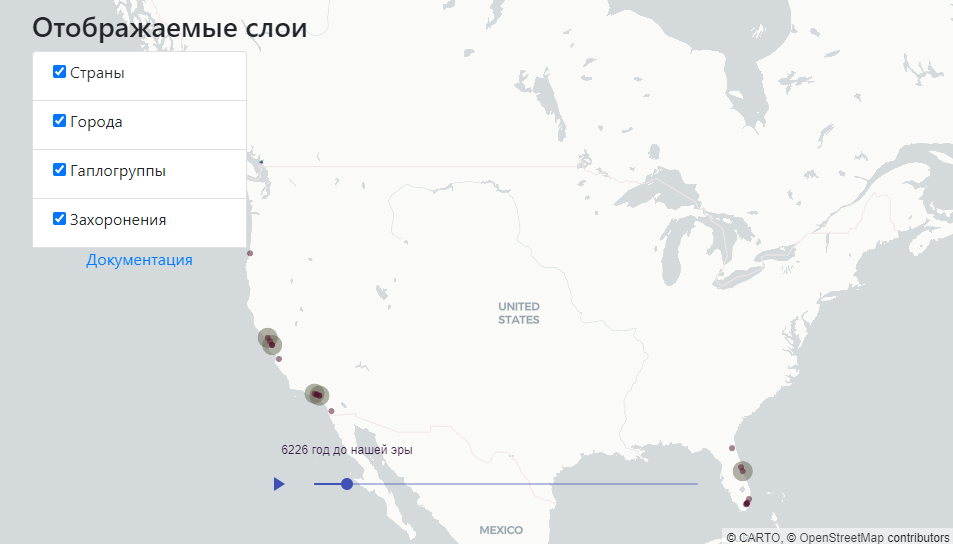

## Данные для исторической карты

В данном репозитории лежат данные для проекта "Историческая карта"




[Сайт проекта](https://hm.buran.center)


Постоянный путь к файлам:
- страны: `https://raw.githubusercontent.com/aok-buran/HistoricalMapData/master/countries.json`
- города: `https://raw.githubusercontent.com/aok-buran/HistoricalMapData/master/cities.tsv`
- гаплогруппы: `https://raw.githubusercontent.com/aok-buran/HistoricalMapData/master/haplogroups.json`
- захоронения: `https://raw.githubusercontent.com/aok-buran/HistoricalMapData/master/bodies.tsv`


## Страны

Файл `countries.json` хранит данные о странах:

```
{
      "type": "Feature",
      "geometry": {
        "type": "Polygon",
        "coordinates": [
          [
            [
              -123.0249569,
              49.2407190
            ],
            [
              -123.0241582,
              49.2407165
            ],
            [
              -123.0240445,
              49.2406847
            ],
            [
              -123.0239311,
              49.2407159
            ],
            [
              -123.0238530,
              49.2407157
            ],
            [
              -123.0238536,
              49.2404548
            ],
            [
              -123.0249568,
              49.2404582
            ],
            [
              -123.0249569,
              49.2407190
            ]
          ]
        ]
      },
      "properties": {
        "name": "C1",
        "info": "Текст",
        "id": "C1",
        "startYear":5000,
        "endYear": 7000,
        "color": [0, 200, 140]
      }
    }
```

в параметре `geometry` указываются вершины полигона, в свойствах `properties`: название страны
`name`, пояснительный текст `info`, id страны `id`, первый и последний годы
периода, когда нужно её отображать `startYear` и `endYear`. Также необходимо указать цвет 
отображения `color`.


## Города

Файл `cities.tsv` хранит данные о городах:

```
id;startYear;endYear;size;colorR;colorG;colorB;name;longitude;latitude
c1;5000;7000;5;100;100;80;UNIVISION RADIO STATIONS GROUP, INC.;-80.37889;25.96861
...
```

СНачала указывает `id` города, потом первый и последний годы
периода, когда нужно его отображать `startYear` и `endYear`. Далее указывается размер
точки, изобрадающий город `size` и её цвет `colorR`, `colorG`, `colorB`.
Также необходимо указать название города `name`, его широту и долготу.


## Гаплогруппа

Файл `haplogroups.json` хранит данные о гаплогруппах:

```
 {
      "type": "Feature",
      "geometry": {
        "type": "Polygon",
        "coordinates": [
          [
            [
              -123.0451346,
              49.2530978
            ],
            [
              -123.0445410,
              49.2530953
            ],
            [
              -123.0445417,
              49.2524382
            ],
            [
              -123.0469300,
              49.2524489
            ],
            [
              -123.0469231,
              49.2531060
            ],
            [
              -123.0451346,
              49.2530978
            ]
          ]
        ]
      },
      "properties": {
        "name": "H6",
        "info": "Текст",
        "id": "H6",
        "startYear":100,
        "endYear": 500,
        "color": [200, 0, 140]
      }
    },
```

в параметре `geometry` указываются вершины полигона, в свойствах `properties`: название гаплогруппы
`name`, пояснительный текст `info`, id гаплогруппы `id`, первый и последний годы
периода, когда нужно её отображать `startYear` и `endYear`. Также необходимо указать цвет 
отображения `color`.

## Захоронения


Файл `bodies.tsv` хранит данные о гаплогруппах захоронений:

```
id haplogroupId colorR colorG colorB longitude latitude
h1 H1 80 10 40 -80.77917 28.35333
...
```

СНачала указывает `id` захоронения, потом `id` гаплогруппы, дальше 0 три компоненты отображаемого
цвета, потом - широта и долгота